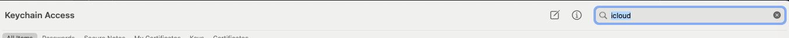
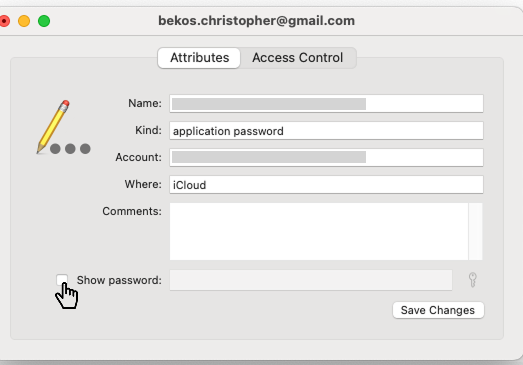

# AppleCollector

Query Apple's Find My network, based on all the hard work
of [OpenHaystack](https://github.com/seemoo-lab/openhaystack/), @vtky, @hatomist and others.

This is a fork of great work from @biemster and modified to have device locations sent to an endpoint.

## Prerequisites

- Install python 3.12 and poetry on your system (`pipx install poetry==1.8.2`) if you don't have it already.
- Install project dependencies: `poetry shell` and `poetry install`

### Project Setup (MacOS)

- Enable iCloud on your macOS device
- Search for `icloud` in the Keychain

- Select the `iCloud` entry with your email address

- Click on `show password` and copy the password

- Use this password as your `PASSWD` in the `.env` file

### Project Setup (non-MacOS)

You cannot use the `python manage.py refresh-credentials` command to refresh the credentials, since this require
access to the macOS keychain (and it's depended on hardware).

## Refresh Credentials

- Use the `python manage.py refresh-credentials --schedule-location-fetching` 
command to refresh the credentials (run on a MacOS, stored on AWS) and schedule location fetching (on AWS)

- Use the `python manage.py refresh-credentials` 
command to refresh the credentials (stored on AWS) without scheduling location fetching

> This command is handy for testing purposes

## Local Debug

- After you have executed `python manage.py refresh-credentials` you have one minute before the credentials expire
- Run `python manage.py fetch-locations --trackers E0D4FA128FA9,EC3987ECAA50,CDAA0CCF4128,EDDC7DA1A247,D173D540749D --limit 1000 --minutes_ago 15`
to fetch the locations of specific trackers
