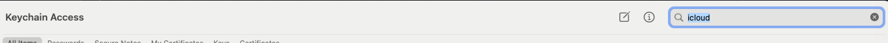

# AppleCollector

Query Apple's Find My network, based on all the hard work
of [OpenHaystack](https://github.com/seemoo-lab/openhaystack/), @vtky, @hatomist and others.

This is a fork of great work from @biemster and modified to have device locations sent to an endpoint.

## Prerequisites

- Install python 3.12 and poetry on your system (`pipx install poetry==1.8.2`) if you don't have it already.
- Install project dependencies: `poetry shell` and `poetry install`

### Project Setup (MacOS)

- Enable iCloud on your macOS device
- Search for `icloud` in the Keychain

- Select the `iCloud` entry with your email address

- Click on `show password` and copy the password

- Use this password as your `PASSWD` in the `.env` file

### Project Setup (non-MacOS)

...

## Scripts

`main.py` will query Apple's Find My network based on private keys fetched from an API and can send locations to an API.

`passwd.sh` will get a one time password for iCloud and store it in `$HOME/.haypass`.

`example.cron.sh` is an example script for running `main.py`.

`launched.AppleCollector.plist` is for periodically running `cron.sh`.

Setup:

    mkdir -p ~/Library/LaunchAgents
    cp launched.AppleCollector.plist ~/Library/LaunchAgents/
    launchctl load -w ~/Library/LaunchAgents/launched.AppleCollector.plist
